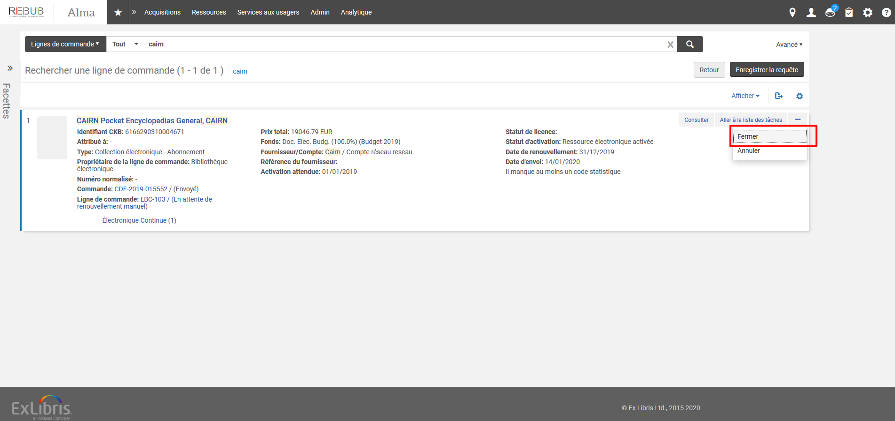
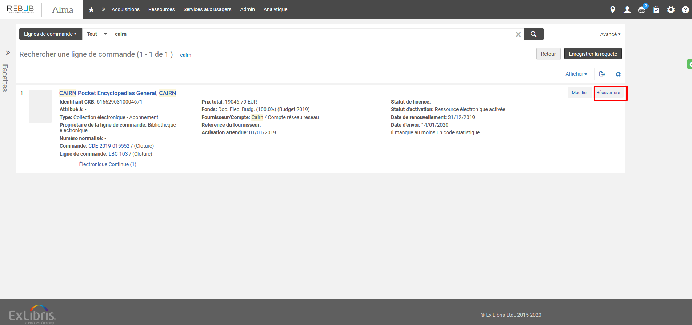
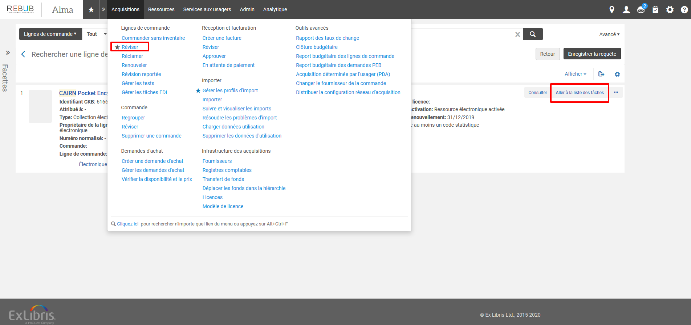

# Commande et facturation des bases de données : renouvellment

## Fermeture/Réouverture de la ligne de commande

Rechercher la ligne de commande et cliquer sur Fermer 

A partir du même écran cliquer su réouverture

La ligne de commande passe alors en rèvison. Cliquer sur "Aller à la liste des tâches" ou Afficher la liste des lignes à réviser. Vous pourrez modifier la commande.

## Modification de la ligne de commande

| Champs | Contenu |
| :--- | :--- |
| Date d'activation prévue | 01 janvier de l'année de renouvellement |
| Tarification | Indiquer le prix net mentionné sur le devis |
| Financement | Indiquer le compte qui sera débité pour l'exercice |
| Méthode d'acquisition | Achat sur la plate-forme du fournisseur \(Empêche l'impression de la commande\) |
| Date de renouvellement | Fin d'année du réengagement. |

Cliquer sur "Enregistrer et continuer"

## Commander

Avec le numéro de bon de commande, aller dans Acquisitions&gt;Commande&gt;Regrouper
Attacher le devis au BC
Cliquer sur "Enregistrer & continuer" ou Commander maintenant

## Facturer 
Prendre le numéro de BC est aller dans Acquisition > Réception & facturation > Facturer
Créer une facture à partir du commande
Rechercher le BC
Supprimer les lignes inutiles
Modifier la ligne de facture :
  - Indiquer les intervales de dates d'abonnement 
  - Ajouter en toute lettre "Année N" dans les informations supplémentaires
  - Prix : remplacer le prix TTC par le dépense budgétaire réel et "Annuler le montant engagé restant"
Renseigner le monatnt de TVA = Dépenses budgétaire - Prix HT Facturé
  

